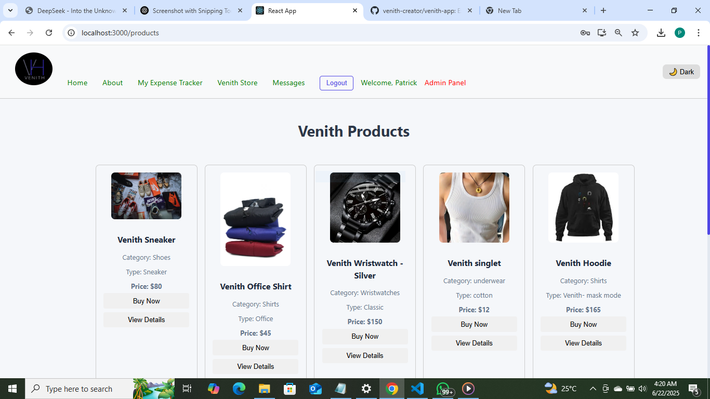
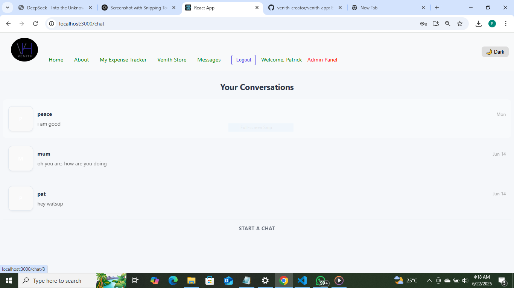
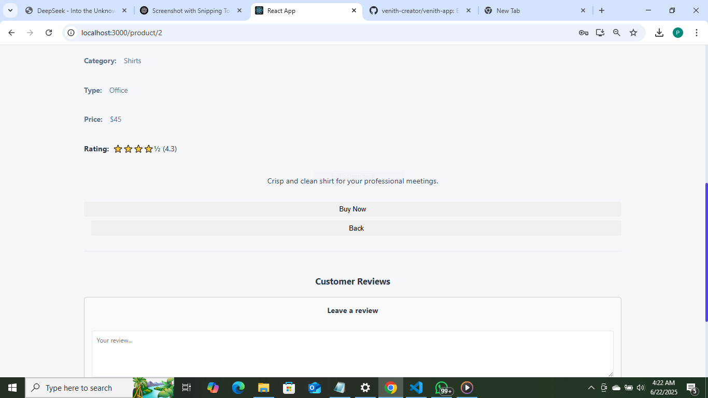
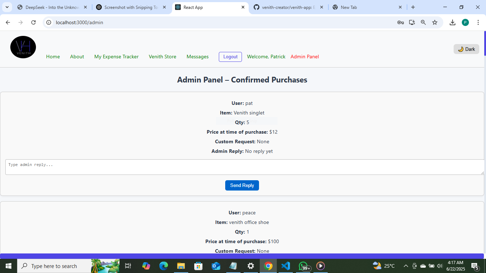

# 🏬 Venith Fullstack App

A full-stack MERN-style application built with:

- ⚛️ React (Frontend)
- 🧠 Express + Node.js (Backend)
- 🗃️ PostgreSQL (Database)
- ☁️ Railway (Deployment)

---

## 📸 Screenshots

### 🏠 Product Page


### 💬 Chat System


### 🧾 Expense Tracker


### 🛍️ Product Details + Review


### 🔒 Admin Panel


---

## 🚀 Features

- ✅ Login & Signup (with JWT auth)
- ✅ Product showcase & details
- ✅ Buy now → adds to expense tracker
- ✅ User reviews with star ratings
- ✅ Chat system (user-to-user)
- ✅ Admin panel for reviews and expenses
- ✅ Dark/Light mode toggle

---

## 🧠 Technologies Used

| Tech         | Usage                         |
|--------------|-------------------------------|
| React        | Frontend components           |
| Express.js   | Backend API                   |
| PostgreSQL   | Relational DB with SQL logic  |
| JWT          | Authentication & Authorization|
| Railway      | Hosting Backend + DB          |
| Toastify     | User notifications            |

---

## 🌐 Live Demo

🚧 Coming soon via [Railway](https://railway.app)

---

## 💻 Setup Instructions

 Clone this repo:
   ```bash
   git clone https://github.com/venith-creator/venith-app.git
   cd react-pg-project

    🧪 What I Learned
    This second fullstack project taught me:

    How to manage both frontend and backend together

    Building chat logic

    Handling PostgreSQL with real CRUD operations

    Designing UIs with themes and admin roles

    Error handling with real user feedback

📢 Contact Me
Want to collaborate or hire me?
📧 Email: patrickaghidi222005@gmail.com
💼 LinkedIn: Linkedln:  www.linkedin.com/in/patrick-aghidi-806365358
🏁 Final Thoughts
Venith is a mix of e-commerce, chat, and expense tracking — a great blend of fullstack logic.